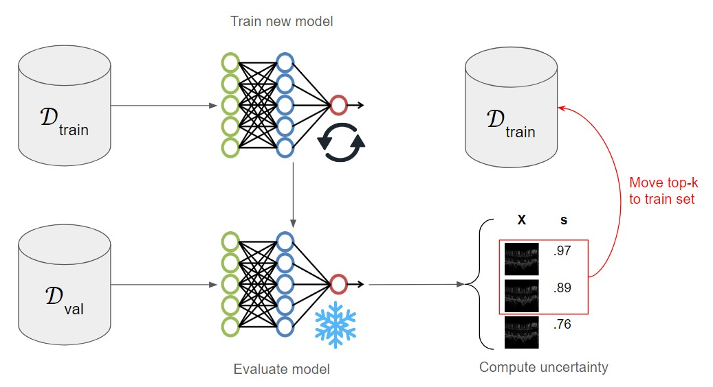
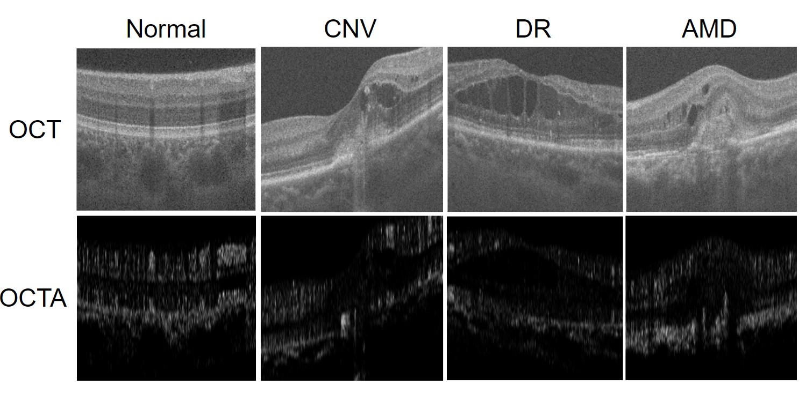

# OCTA500-classification

This repository contains supplementary code for link[Enhancing Retinal Disease Classification from OCTA Images via Active Learning Techniques](), published in Data Engineering in Medical Imaging (DEMI) workshop at MICCAI 2024. In this work, we analyze active learning as a data subset technique to improve classification performance on OCTA images.

  

Figure: Schematic diagram of active learning pipeline, where $`\mathcal{D}_{train, val}`$ are the train and validation set, respectively, X is an image, s is the uncertainty score, and k is the number of images to move into the train set after each active learning iteration.

## Dataset

We utilize the OCTA500 dataset, which contains images of healthy, age-related macular degeneration (AMD), chorodial neovascularization (CNV), and diabetic retinopathy (DR) retinas. More details can be found link[here](https://arxiv.org/abs/2012.07261)

  

Figure: Comparison of OCT and OCTA data for Normal, CNV, DR, and AMD eyes.

## Classification results

| Training Method                   | Acc   | F1    |
|-----------------------------------|-------|-------|
| Unbalanced                        | .5139 | .4864 |
| Inverse Frequency Class Weighting | .4956 | .4571 |
| Random Undersampling              | .4482 | .3334 |
| Oversampling (AutoAugment)        | .4178 | .4136 |
| Oversampling (AugMix)             | .4647 | .4503 |
| Least Confident Sampling          | .7313 | .6285 |
| Entropy Sampling                  | .7188 | .6187 |
| Margin Sampling                   | .7282 | .6262 |
| Ratio Sampling                    | .7688 | .7116 |